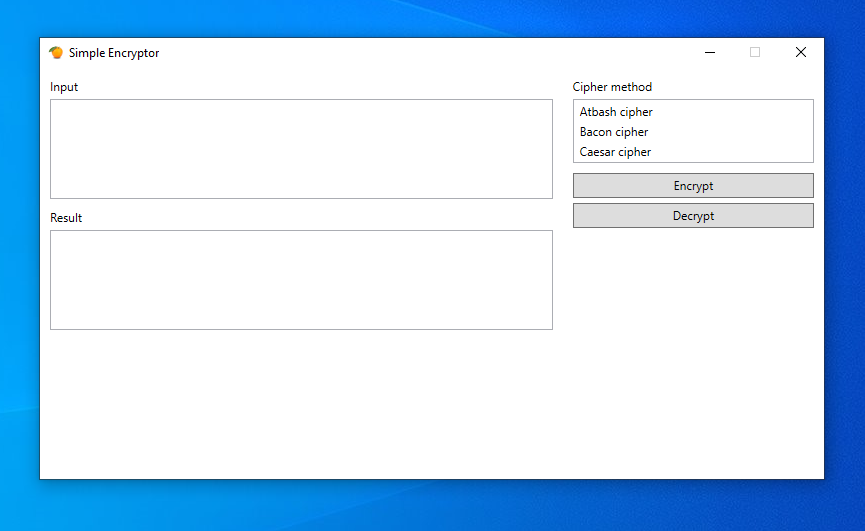

# Simple-Encryptor

A simple encryptor that uses various encryption methods. Assemblies with different encryption methods are located in the [Plugins](src/Jevstafjev.Encryptor/Jevstafjev.Encryptor.Wpf/Plugins) folder. Types are extracted using reflection.

## Cipher methods

### Atbash cipher
The [Atbash cipher](src/Jevstafjev.Encryptor/Jevstafjev.Encryptor.AtbashCipher) is a simple substitution cipher that maps each letter of the alphabet to its reverse (A ↔ Z, B ↔ Y, etc.).

### Bacon cipher
The [Bacon cipher](src/Jevstafjev.Encryptor/Jevstafjev.Encryptor.BaconCipher) is a substitution cipher that encodes letters into sequences of five binary digits (A or B). Each letter of the alphabet is represented by a unique combination.

### Caesar cipher
The [Caesar cipher](src/Jevstafjev.Encryptor/Jevstafjev.Encryptor.CaesarCipher) is a simple substitution cipher where each letter in the plaintext is shifted a fixed number of positions down the alphabet. It is one of the oldest known encryption techniques.
